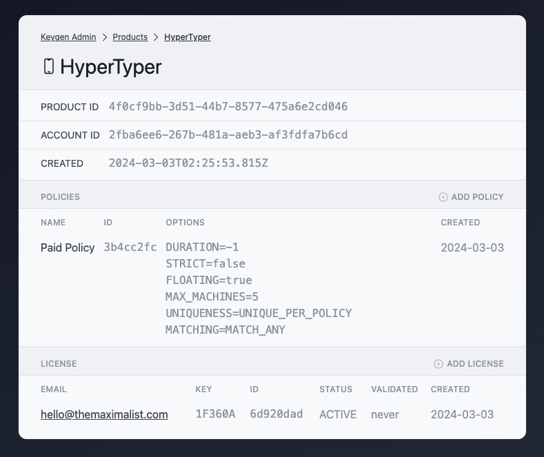

## Keygen Admin

> An admin dashboard for Keygen.sh, create products, policies and licenses

 

**Keygen Admin** is a frontend UI for interacting with a self-hosted [Keygen.sh](https://keygen.sh/) instance. Keygen is a service for managing license keys in software.

If you're an app developer, and you sell software with a license, Keygen.sh is an easy API to manage that. They provide a self-hosted option, so you can run it on your own servers.

`Keygen Admin` is simple UI over that API.

## Keygen.js

Check out the underlying [Keygen.js](https://github.com/themaximal1st/keygen.js) library for interacting with the Keygen API.

## Projects

`Keygen.js` is currently used in the following projects:

-   [HyperTyper](https://hypertyper.com) — multidimensional mind mapping

## License

MIT

## Author

Created by [The Maximalist](https://twitter.com/themaximal1st), see our [open-source projects](https://themaximalist.com/products).

